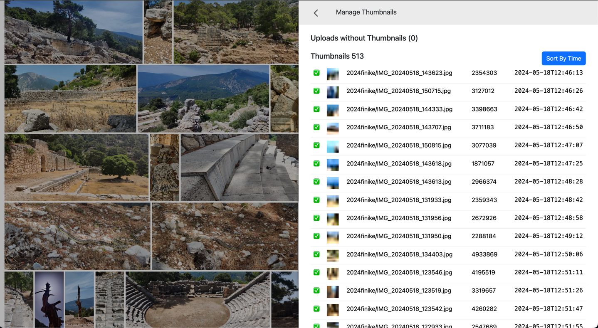

# Photo Folder from S3

Next.JS project (+ Lambda functions to extract metadata from images) to browse and manage the files uploaded to the 
S3 bucket.

You will need an S3 bucket with folders of images. You can create the bucket with a `serverless` project in 
[upload-handler](). It will also install the lambda triggers that would run after each new uploaded image to extract 
metadata and store them in the `.thumbnails.json` file. It will also extract the thumbnail of the uploaded 
image and store it in the `.thumbnails/` subdirectory.

S3 structure:

```
/
    - folder-name/
        - .thumbnails.json
        - .thumbnails/
            - IMG_20240101_101010.jpg
        - IMG_20240101_101010.jpg
        - ...more images (and more thumbnails)
```

I use the [S3 Drive](https://s3drive.app/) app to upload images into S3 bucket from Android phone.

Configure the AWS access to the bucket in `.env` file then run the Next.JS project to have an UI. 



You can:

* see image thumbnails in a grid
* click image to see full screen view
* use [Left] and [Right] keys to browse previous/next images
* Press [Delete] or [X] to select images and put them into delete queue
* Delete queue will be shown at the bottom of the screen
* Delete image from the delete queue
* Sort images by date/time
* If the files have an ISO date in the name, this data will be used instead of the timestamp of modification

## Thumbnails.JSON

This is an array of image information with the following properties:

```
[
  {
    "key": "2024 Cyprus/2024-03-30_09_41_32_411_0.jpg",
    "size": 443429,
    "modified": "2024-04-03T05:44:57.000Z",
    "base64": "data:image/png;base64,iVBORw0KGgoAAAANSUhEUgAAAAgAAAAECAIAAAA8r+mnAAAACXBIWXMAAAsTAAALEwEAmpwYAAAAb0lEQVR4nAFkAJv/AD5beUR6tC1pnjRtokd4qWWTxHef04av4gDk5+1zfYlFVmgZPFknVn0ZS28STHcsY48AZ2FYPjMl2se0ppeLjIV9PURMu8LIABQcADo5MrmtoIV9cq6jl97Kt+HOuv/433RlVLzBLzeAPN9GAAAAAElFTkSuQmCC",
    "metadata": {
      "width": 2400,
      "height": 1080,
      "format": "jpeg",
      "size": 443429,
      "space": "srgb",
      "channels": 3,
      "depth": "uchar",
      "density": 72,
      "chromaSubsampling": "4:2:0",
      "isProgressive": false,
      "hasProfile": true,
      "hasAlpha": false,
      "orientation": 1
    }
  }
]
```

* base64 is the 8x8 image that can be used as the placeholder while the thumbnail is loading. It does not allow to 
  distinguish what is on the photo, but gives the sense of colors of that image.

## Todo

* [ ] sort files by date
* [ ] extract EXIF information as well
* 